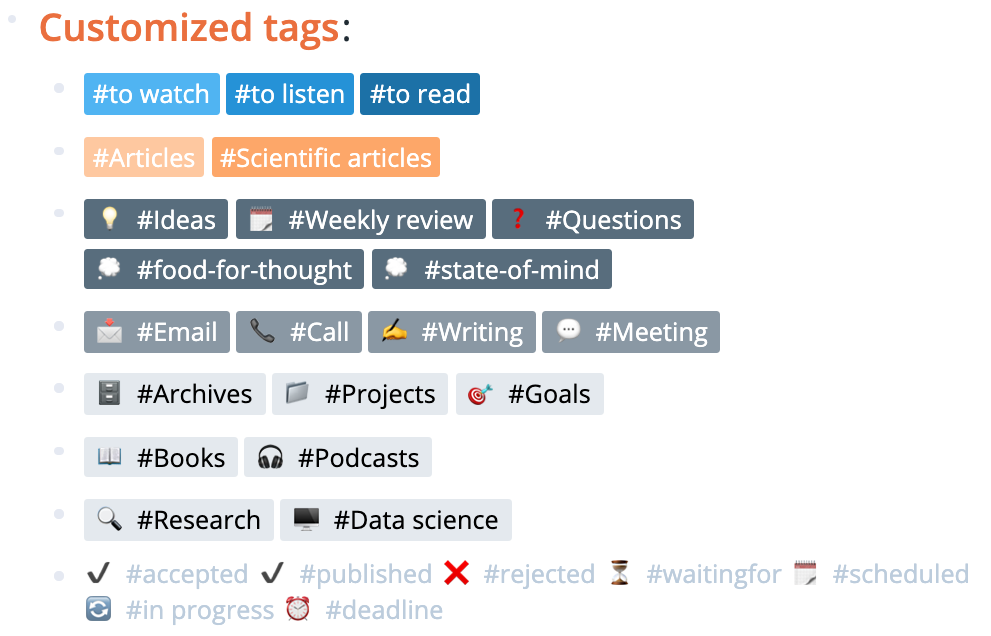
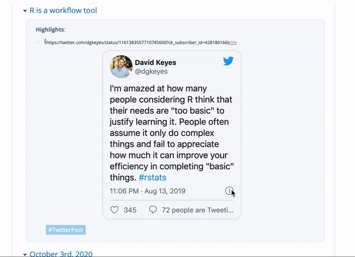
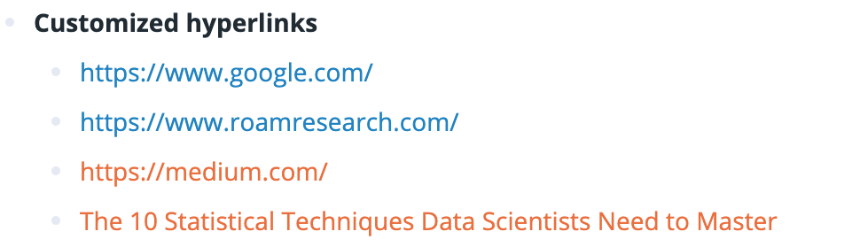
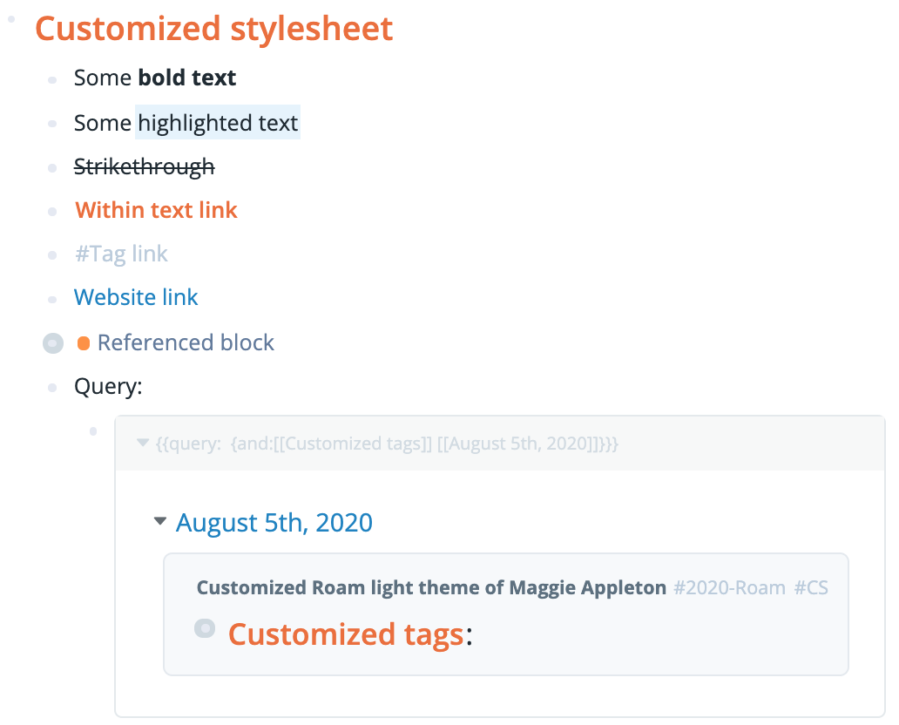
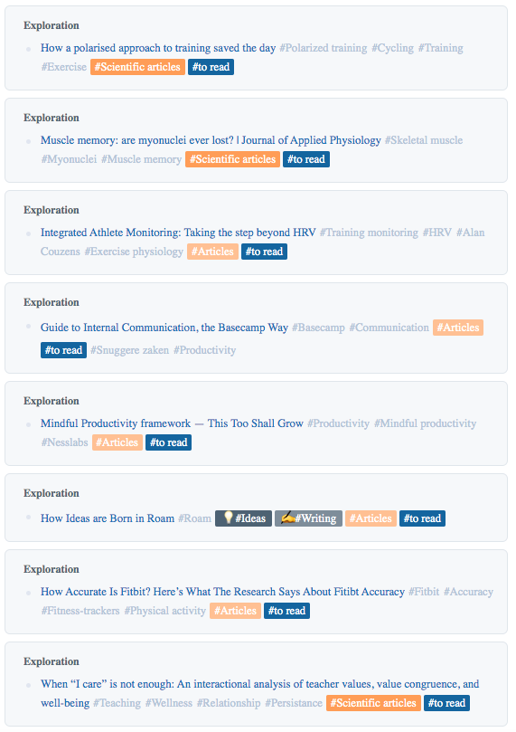

<h1>Customized Roam stylesheet </h1>
Customized roam-light-theme stylesheet inspired by Maggie Appleton

<h4>Containing:
- data tags
- tweets
- hyperlinks
- highlights and more </h4>

 

<h3>Customized data tags </h3>

I am a big fan of the [Stylesheet of Maggie Appleton](https://gist.github.com/MaggieAppleton/3d86fcec241a6277ca093f5267cf4326), and especially like the possibility to customize data tags as she explained on her [website](https://maggieappleton.com/paintingroam).

I've created several data tags, and you can use these straightaway if you copy the CSS code of the `custom-data-tags.css` file into your `roam/css` page. As you may have noticed, the data tags also include symbols and icons before the tag. You can create your own tags by changing the CSS code. For adding your own symbols or icons, I recommend you to go to [Emojipedia](https://emojipedia.org/)

 

 

<h3>Customized tweets </h3>

Do you want your Tweets to be a bit smaller? That can also be done using CSS. 
I have adjusted the size of the embedded Tweets, which is shown here below:

 

 

<h3>Customized hyperlinks </h3>

Based on the URL of the hyperlink, you can now also create custom colors for specific websites.
In this example, references made to a URL that starts with https://medium.com/ will be colored orange instead of blue.

 

 

<h3>Customized stylesheet </h3>

In brief, I made several adjustments to the CSS stylesheet of Maggie Appleton to make my [Roam](https://roamresearch.com/) look like this:

 

 

<h3>Example of reading list </h3>

Here, you find an example of what my queried reading list looks like with the added custom data tags.

